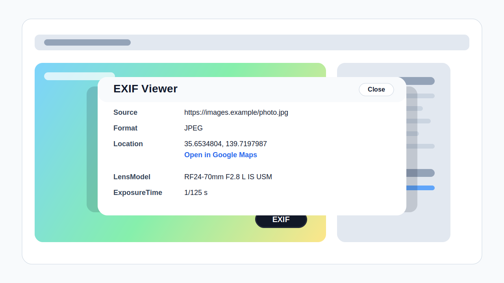

# exif-viewer – Hover EXIF Viewer

画像にマウスカーソルを載せている間だけ小さなボタンを表示し、その画像の EXIF 情報をページ内モーダルで確認できる Chrome / Edge 向け Manifest V3 拡張です。

[English README](README.md)



## 機能

- 画像の右下付近に `EXIF` ボタンをホバー時のみ表示
- JPEG / PNG (`eXIf`) / WebP (`EXIF`) / TIFF の EXIF を解析
- カメラモデル、レンズ、撮影日時、露出、画像サイズ、GPS など高頻度で有用な EXIF 情報をより多く表示
- 各項目に分かりやすいタイトルを付け、マウスオーバー時のツールチップで意味を確認可能
- `Decode XMP` ボタンから、XMP の hex/binary 表示とデコード済みプロパティ一覧を左右並びで確認可能
- CDN などのクロスオリジン画像も service worker 経由で取得して表示
- 外部依存なしの軽量なページ内 UI

## ファイル構成

```text
exif-viewer/
├── manifest.json      Manifest V3 設定
├── shared.js          runtime / test で共通利用する EXIF 解析ヘルパー
├── background.js      クロスオリジン画像取得用 service worker
├── content.js         ホバー UI と EXIF モーダル
└── tests/             Node ベースの parser / UI テスト
```

## 拡張の読み込み

1. `chrome://extensions` または `edge://extensions` を開く
2. **デベロッパーモード** を有効にする
3. **パッケージ化されていない拡張機能を読み込む** を押す
4. `exif-viewer/` ディレクトリを選ぶ

## テスト

```bash
node --test exif-viewer/tests/*.test.js
```
