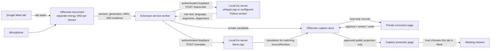

# Meet Translator architecture

## Current data path

The presenter and correction page are separate extension pages. The popup can open either one. The host must choose the presenter tab in Meet's normal screen-sharing UI; opening it does not start sharing. Keep the correction page private. Microphone capture can be enabled independently, but microphone captions are private by default.

## Responsibilities and boundaries

- `extension/offscreen.js` captures Meet-tab and microphone streams through separate processors and separate energy-VAD state. Each utterance includes its stream, session, generation, speech duration, and observed clipping/VAD evidence. Audio passes to the service worker in memory; the capture path does not intentionally write meeting audio to disk.
- `extension/background.js` validates current session/generation, calls only the configured local loopback service with a bearer token, and keeps ASR candidates private. Current `audioQueue` is a serial Promise chain without the required item, duration, or deadline bounds; see T15. Model inference remains local and the extension does not search for or update models during a meeting.
- `extension/caption-store.js` owns session/revision state and persistence budget. It keeps unapproved candidates private, publishes only the strict approved projection, and invalidates translations after a source correction. `caption-protocol.js` strips raw ASR, diagnostics, settings, glossary contents, and private identity fields.
- `extension/sidepanel.html` is the host-only correction/history page. It supports review reasons, approve, correct, undo, and revision-bound translation state. `extension/caption-presenter.html` displays only the public protocol and the two most recent approved records.
- `server/` provides token-authenticated loopback endpoints and uses the configured local ASR and translation paths. `/transcribe` and `/translate` are separate requests. Native Whisper returns candidate text and available segment timing/logprob/no-speech metadata; a fixed patch to the vendored `whisper.cpp` prevents its no-speech decoder heuristic from erasing candidate text before private review. That patch does not alter score calibration or automatically approve text. Whisper score thresholds create review reasons only. Other backends do not inherit Whisper thresholds. Unknown scores stay null.
- Optional Python ASR input is transported as a base64 request and decoded to in-memory bytes/waveform. WhisperX timing can be reported, while unavailable score fields remain null. This API contract does not prove model quality or M1 execution.
- The code builds native `whisper.cpp` and `llama.cpp` paths. The inspected llama vendor commit and Makefile pin label differ. Python ASR alternatives exist but are not part of a qualified one-ASR/one-translator runtime lock.

## Evaluation and qualification boundary

`eval/` and `server/cmd/eval/` keep three tracks separate: ASR-only, MT-only with correct source text, and audio-to-public-caption end-to-end. Current cases are synthetic contracts only. The small silence WAV checks local path and hash handling; it is not a quality example. There is no human-reviewed bilingual development/holdout set, model output adapter/scorer, M1 model measurement, or actual Meet share run.

The research lock is `PROFILE_NOT_QUALIFIED`. A green code or fixture test only establishes the tested code contract. It does not establish model quality, M1 memory/latency, or that Google Meet shares the presenter successfully. See [`implementation-status.md`](implementation-status.md), [`m1-max-performance.md`](m1-max-performance.md), and [`manual-test-plan.md`](manual-test-plan.md).
